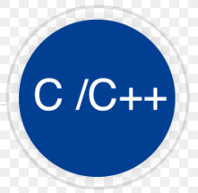

# defender-of-the-organization
Game with c and Allegro
 
<table>
	<tr>
		</td colspan="2">Used Technologies</td>
	</tr>
	<tr>
		<td>
			
		</td>
		<td>
			<b>C Programming and C++ Programming</b> 
			<a href="https://www.cprogramming.com/" target="_blank">Documentation</a>
		</td>
	</tr>
	<tr>
		<td>
			
		</td>
		<td>
			<b>Allegro 5</b> 
			<a href="https://liballeg.org/" target="_blank">Documentation</a>
		</td>
	</tr>
</table>
